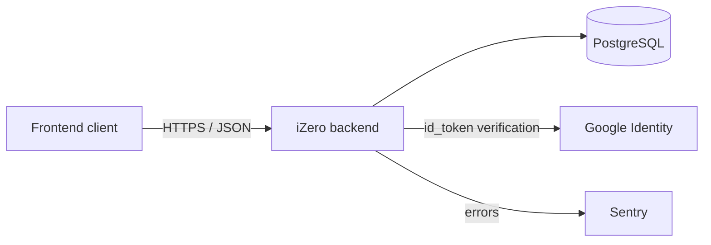

# 01 – System Overview

## Purpose

Backend of the iZero invoicing system. Provides a REST API for managing users, their roles and modules, customers, addresses and banking details.

TODO: add the business goal and target users.

## Scope

**In scope:**
- TODO: list (e.g. registration and login, module management, lookup tables, ...)

**Out of scope:**
- TODO: list (e.g. frontend, PDF generation, payment gateway, ...)

## System context

## Technology stack

| Area | Choice |
|------|--------|
| Language | Python 3.11 |
| Web framework | FastAPI + Uvicorn |
| ORM | SQLAlchemy 2.x (declarative, `Mapped`) |
| Migrations | Alembic |
| Database | PostgreSQL |
| Configuration | pydantic-settings (`.env`) |
| Authentication | JWT (python-jose), passlib, Google OAuth id_token |
| Monitoring | Sentry SDK |
| Containerization | Docker |

## Glossary

| Term | Meaning |
|------|---------|
| Session | Server-side client session identified by the `sid` cookie (exists for anonymous users too) |
| Access token | Short-lived JWT sent in the `Authorization: Bearer` header |
| Refresh token | Random token in an httpOnly cookie, bound to a session |
| CSRF token | Random token in a JS-readable cookie, protects against CSRF |
| Module | Functional area of the application that can be granted to a user for a time period |
| Validity period | Time validity of a record (`valid_from` / `valid_to`) |
| Message ID | Numeric message code returned by the API instead of free-form text |
| TODO | Add remaining terms |
