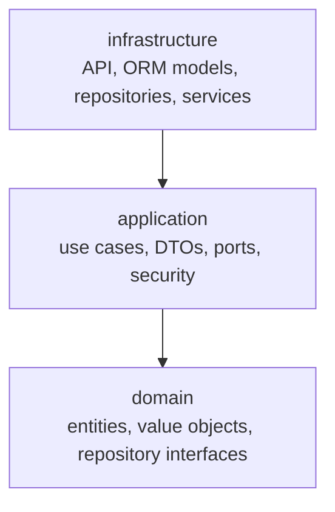
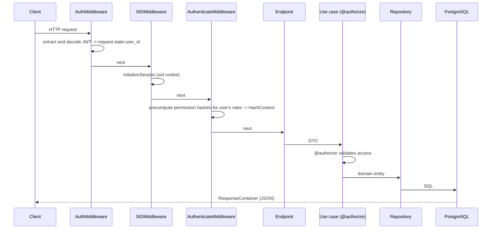

# 02 – Architecture

The project follows a layered (clean) architecture. Dependencies always point inward — the domain knows nothing about the application layer, and the application layer knows nothing about infrastructure.

## Layers



| Layer | Directory | Responsibility | What does not belong here |
|-------|-----------|----------------|---------------------------|
| Domain | `app/domain` | Entities, value objects, domain exceptions, repository interfaces | SQLAlchemy, FastAPI, HTTP |
| Application | `app/application` | Use cases, DTOs, ports (protocols), authentication/authorization | Concrete technologies |
| Infrastructure | `app/infrastructure` | FastAPI endpoints, middleware, SQLAlchemy models and repositories, external services | Business rules |

## Package structure

```
app/
├── domain/            # addresses, auth, bank, customers, modules, session, shared, users
│   └── <context>/
│       ├── entities/          # domain entities
│       ├── value_objects/     # immutable value types
│       ├── repositories/      # abstract repository interfaces
│       └── exceptions/        # domain exceptions
├── application/
│   ├── use_cases/     # auth, sessions, users
│   ├── dto/           # input/output contracts of use cases
│   ├── ports/         # TimeProvider, PasswordHasher, TokenGenerator, IdentityProvider, ...
│   ├── security/      # AuthContext, Authenticate, Authorize, hash context
│   ├── constants/
│   └── exceptions/
└── infrastructure/
    ├── api/           # main.py, router.py, endpoints/, middleware/, schemas/, dependencies/
    ├── models/        # SQLAlchemy ORM models
    ├── repositories/  # repository implementations (Alchemy*)
    ├── services/      # JWT, hashing, token generators, time
    ├── providers/     # Google identity provider
    ├── database/      # Base, engine, session
    ├── alembic/       # migrations
    └── config.py      # Settings
```

## Naming conventions

- A use case is a class with a single `execute()` method, named after a verb (`InitializeSession`, `Authenticate`).
- DTOs are named `<UseCase>In` / `<UseCase>Out`.
- ORM models are named `<Entity>Model` (e.g. `UserRoleModel`).
- Repository implementations are named `Alchemy<Entity>Repository` and inherit from `BaseAlchemyRepository`.
- A domain entity never shares its name with an ORM model — mapping happens inside the repository.

## HTTP request flow



> Note: Starlette runs middleware in reverse registration order, which is why `AuthMiddleware` is added last.

> Note: `AuthenticateMiddleware` only confirms the user is authenticated and precomputes which (entity, method) pairs they may call. The actual access check per use case happens inside the use case itself, via `@authorize` — see [06 – Security § Authorization](06-security.md#authorization) for details.

## Dependency injection

Dependencies are composed in `app/infrastructure/api/dependencies/` using `Depends`. The container builds repositories and services and passes them to the use case.

TODO: decide whether to introduce a single DI container instead of inheriting from use case classes.

## Known technical debt

TODO: keep this list up to date (e.g. inconsistent imports in `endpoints/token.py`, DB sessions opened directly inside middleware, missing transaction boundaries).
