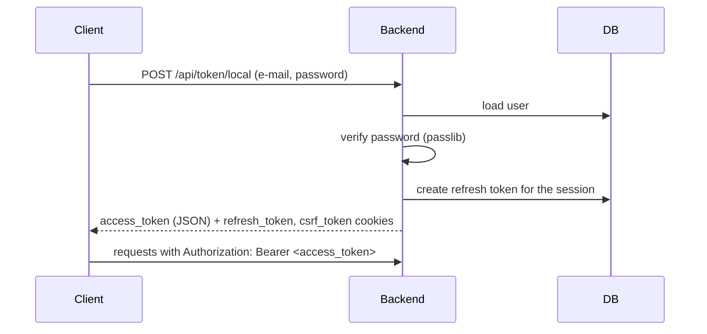

# 06 – Security

## Overview

| Mechanism | Carrier | Lifetime | Implementation |
|-----------|---------|----------|----------------|
| Access token | JWT in the `Authorization: Bearer` header | `ACCESS_TOKEN_EXPIRE_MINUTES` | [jwt_access_token_generator.py](../app/infrastructure/services/jwt_access_token_generator.py) |
| Refresh token | httpOnly cookie `refresh_token` | `REFRESH_TOKEN_EXPIRE_MINUTES` | [refresh_token_generator.py](../app/infrastructure/services/refresh_token_generator.py) |
| CSRF token | cookie `csrf_token` (JS-readable) | until end of session | [csrf_token_generator.py](../app/infrastructure/services/csrf_token_generator.py) |
| Session ID | httpOnly cookie `sid` | `SESSION_EXPIRE_MINUTES` | [middleware/sid.py](../app/infrastructure/api/middleware/sid.py) |

Cookies are set with `secure=True` and `samesite="strict"`.

## Authentication

Supported providers:

1. **Local** — e-mail + password, hashed via passlib (`PWD_CONTEXT_SCHEME`).
2. **Google** — `id_token` verified against `GOOGLE_OAUTH_CLIENT_ID` ([providers/auth_google.py](../app/infrastructure/providers/auth_google.py)).

### Login flow



JWT payload: `sub` (user_id), `exp`. Signed with the algorithm from `ALGORITHM` using the `SECRET_KEY`.

TODO: describe access token renewal via the refresh token and logout (session invalidation).

## Authorization

Model: RBAC with time validity, enforced in two steps — a coarse check in middleware and a real per-use-case check inside the use case itself.

```
user -> user_roles (validity) -> roles -> role_permission (validity)
role_permission = entity_type + method
```

**Step 1 — precompute allowed actions (`AuthenticateMiddleware` → `Authenticate`)**

[`Authenticate`](../app/application/security/authenticate.py) runs on every request for an authenticated user. It loads the user's currently valid roles and, for each one, their currently valid `role_permission` rows (`entity_type` + `method`). For every allowed `(entity_type, method)` pair it generates an HMAC-SHA256 signature over `user_id:secret_message:entity:method` ([`AuthHash.generate`](../app/application/security/auth_hash.py)) and stores the resulting list of hashes in `HashContext`. This step only proves the user is authenticated and has *some* valid role — it does not yet check access to a specific use case.

**Step 2 — real access check (`@authorize` on the use case)**

The endpoint calls the use case, but the use case itself decides whether the call is allowed. A use case that requires authorization decorates its `execute()` method with `@authorize(entity, use_case)` ([application/security/authorize.py](../app/application/security/authorize.py)):

- `entity` is a single `EntityType` member and `use_case` a single `UseCase` member, passed explicitly at the decorator call site — not inferred from the file path or any other implicit source.
- It recomputes the expected hash for `(caller_id, secret_message, entity.value, use_case.value)` and checks it against the hashes stored in `HashContext` during step 1.
- If no match is found, it raises `AuthHashVerificationError`, caught globally in [main.py](../app/infrastructure/api/main.py) and returned as 403 `AUTH_NOT_ACCESS`.

This means: **the endpoint has no say in authorization** — it is impossible to call a use case without going through its own `@authorize` check, regardless of which endpoint (or test) invokes it.

- `AuthContext` holds the identity (`user_id`) of the current request.
- `HashContext` holds the per-request list of precomputed permission hashes.
- `SecretMessageContext` holds a per-request random value so hashes can't be replayed across requests.

### Current `EntityType` values

Defined in [`app/domain/shared/constants/entity_type.py`](../app/domain/shared/constants/entity_type.py): `ADDRESSES`, `USERS`, `AUTH`, `BANK`, `SESSION`, `CUSTOMERS`, `MODULES`.

### Use cases currently protected by `@authorize`

| Use case | `EntityType` | `UseCase` |
|----------|--------------|-----------|
| [`AssignRolePermission`](../app/application/use_cases/auth/assign_role_permission.py) | `AUTH` | `AUTH_ASSIGN_ROLE_PERMISSION` |
| [`AssignModule`](../app/application/use_cases/users/assign_module.py) | `USERS` | `USERS_ASSIGN_MODULE` |
| [`RetrieveModules`](../app/application/use_cases/users/retrieve_modules.py) | `USERS` | `USERS_RETRIEVE_MODULE` |

Use cases without an `@authorize` decorator (e.g. session initialization, login) run without a permission check by design.

## Middleware

Registered in [main.py](../app/infrastructure/api/main.py). Starlette runs middleware in reverse registration order:

1. `AuthMiddleware` — decodes the JWT and populates `request.state.user_id` and `AuthContext`. Without a token the request continues as anonymous.
2. `SIDMiddleware` — initializes or restores the session and sets the `sid` cookie.
3. `AuthenticateMiddleware` — for an authenticated user, runs `Authenticate` (step 1 above). It does **not** perform the actual authorization check — see above.

## Exception handling

| Exception | Response |
|-----------|----------|
| `AuthHashVerificationError` | 403, `AUTH_NOT_ACCESS` |
| `UnauthenticatedUserError` | 401, `AUTH_NOT_AUTHENTICATED` |
| any unhandled exception | 500, `SYSTEM_INTERNAL_FAIL`, reported to Sentry |

Internal error details are never returned to the client.

## Security checklist

- [ ] Secrets live only in `.env` / a secret store, never in the repository
- [ ] `SECRET_KEY` has sufficient entropy and can be rotated
- [ ] CORS origin is an explicit list, not a wildcard
- [ ] Passwords are never logged or returned in a response
- [ ] Brute-force protection on login endpoints — TODO
- [ ] Rate limiting — TODO
- [ ] CSRF token validation on state-changing requests — TODO document where it is validated
- [ ] Audit log of security events (`session_log`) — TODO define scope
