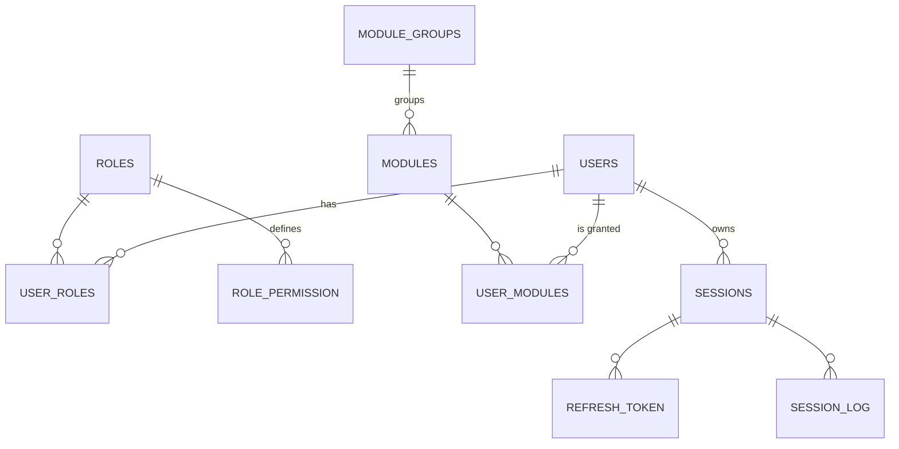

# ER Diagram

Entity-relationship diagram for the database described in [04 – Data Model](04-data-model.md).

```mermaid
erDiagram
    USERS ||--o{ USER_ROLES : "has"
    ROLES ||--o{ USER_ROLES : ""
    ROLES ||--o{ ROLE_PERMISSION : "defines"
    USERS ||--o{ USER_MODULES : "is granted"
    MODULES ||--o{ USER_MODULES : ""
    MODULE_GROUPS ||--o{ MODULES : "groups"
    USERS ||--o{ SESSIONS : "owns"
    SESSIONS ||--o{ REFRESH_TOKEN : ""
    SESSIONS ||--o{ SESSION_LOG : ""
```

TODO: extend with customers, addresses and banks.
